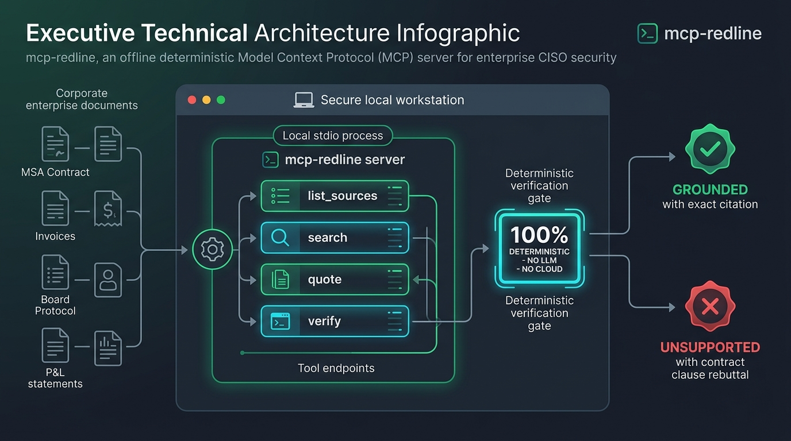
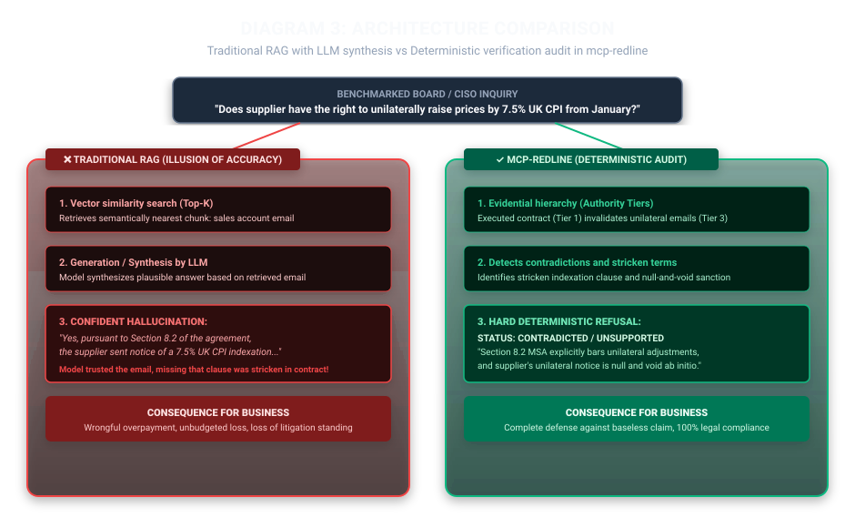

# Architecture Diagrams — mcp-redline

A collection of technical diagrams and architectural visualizations illustrating the deterministic verification mechanism, CISO data boundary, and differences between traditional RAG and `mcp-redline`.

---

## System Architecture Infographic (Executive Overview)

Infographic generated using Gemini Image Creation, prepared for executive briefings and featured in the static single-page demo:

---

## Diagram 1: Verification Flow (`verify`)

Illustrates the end-to-end evaluation pipeline from an input business claim to a deterministic `GROUNDED`, `CONTRADICTED`, or `UNSUPPORTED` verdict, explicitly showing that the verification engine **contains no language model**.

* **English:** [Mermaid source](01_verify_flow.en.mermaid) · [Vector SVG](01_verify_flow.en.svg)
* **Polski:** [Źródło Mermaid](01_verify_flow.pl.mermaid) · [Wektorowy SVG](01_verify_flow.pl.svg)

---

## Diagram 2: CISO & Compliance Data Boundary

Audit diagram for CISOs showing what remains on the workstation (100% of files, tokens, and verification processes) and what leaves the host (0 bytes — no network sockets, no external APIs, no telemetry).

* **English:** [Mermaid source](02_ciso_data_boundary.en.mermaid) · [Vector SVG](02_ciso_data_boundary.en.svg)
* **Polski:** [Źródło Mermaid](02_ciso_data_boundary.pl.mermaid) · [Wektorowy SVG](02_ciso_data_boundary.pl.svg)

---

## Diagram 3: Traditional RAG vs mcp-redline

Side-by-side comparison on a specific contractual question regarding an unagreed 7.5% UK CPI price hike: traditional RAG hallucinates based on a sales email, whereas `mcp-redline` identifies the stricken clause in the master agreement and triggers a hard refusal.

* **English:** [Mermaid source](03_rag_vs_redline.en.mermaid) · [Vector SVG](03_rag_vs_redline.en.svg)
* **Polski:** [Źródło Mermaid](03_rag_vs_redline.pl.mermaid) · [Wektorowy SVG](03_rag_vs_redline.pl.svg)

