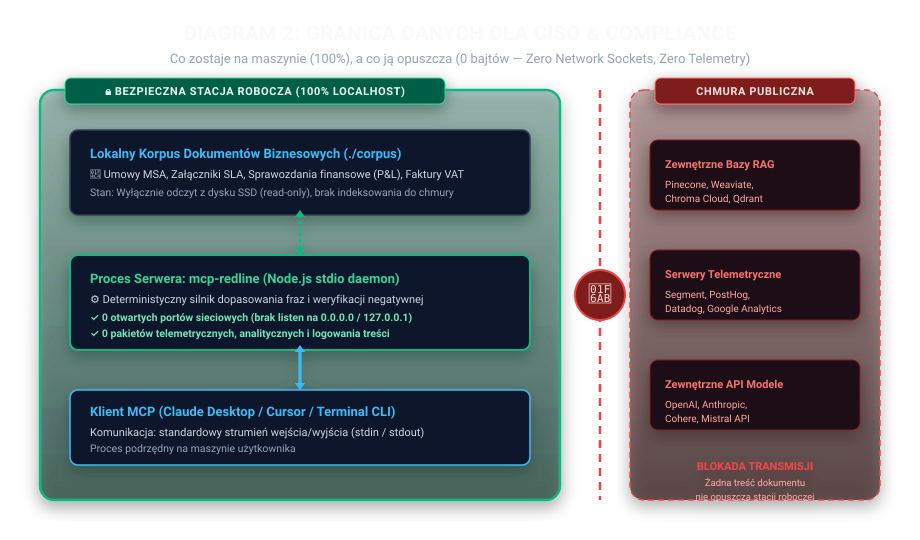
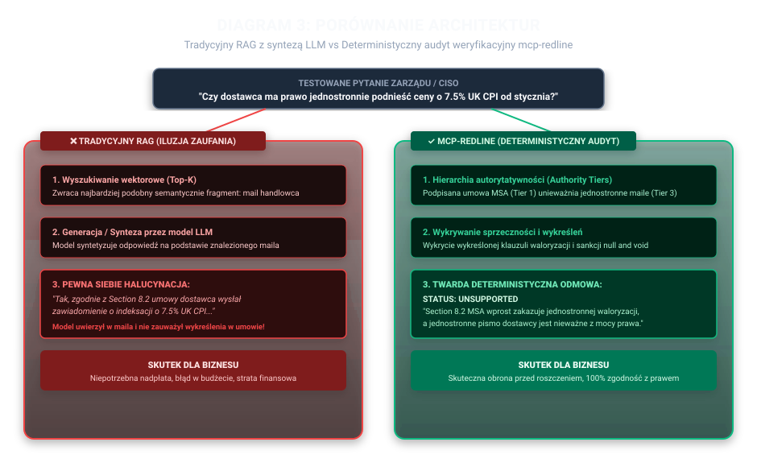

# Diagramy Architektury — mcp-redline

Kolekcja diagramów technicznych i wizualizacji architektonicznych tłumaczących mechanizm deterministycznej weryfikacji, granicę danych dla CISO oraz różnicę między tradycyjnym RAG a `mcp-redline`.

---

## Infografika Architektury Systemu (Executive Overview)

Infografika wygenerowana przy pomocy Gemini Image Creation, przygotowana pod kątem prezentacji zarządczych oraz wizualizacji w statycznym demo single-page:

---

## Diagram 1: Przepływ Weryfikacji `verify`

Pokazuje pełną ścieżkę od twierdzenia biznesowego do twardego wyniku `GROUNDED` lub `UNSUPPORTED`, z wyraźnym zaznaczeniem, że w silniku weryfikującym **nie ma modelu językowego**.

* **Źródło Mermaid:** [`01_verify_flow.mermaid`](01_verify_flow.mermaid)
* **Wersja wektorowa SVG:** [`01_verify_flow.svg`](01_verify_flow.svg)

---

## Diagram 2: Granica Danych dla CISO & Compliance

Diagram audytowy dla CISO pokazujący, co zostaje na stacji roboczej (100% plików, tokenów i procesów), a co opuszcza maszynę (0 bajtów — brak portów sieciowych, brak zewnętrznych API, brak telemetrii).

* **Źródło Mermaid:** [`02_ciso_data_boundary.mermaid`](02_ciso_data_boundary.mermaid)
* **Wersja wektorowa SVG:** [`02_ciso_data_boundary.svg`](02_ciso_data_boundary.svg)

---

## Diagram 3: Porównanie Tradycyjnego RAG vs mcp-redline

Zestawienie dwóch podejść na przykładzie konkretnego pytania o klauzulę waloryzacji cen o 7.5% UK CPI: tradycyjny RAG halucynuje na podstawie maila handlowca, podczas gdy `mcp-redline` wykrywa wykreślenie klauzuli w umowie ramowej i zwraca twardą odmowę.

* **Źródło Mermaid:** [`03_rag_vs_redline.mermaid`](03_rag_vs_redline.mermaid)
* **Wersja wektorowa SVG:** [`03_rag_vs_redline.svg`](03_rag_vs_redline.svg)

